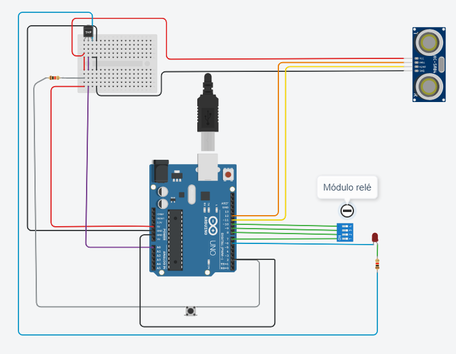
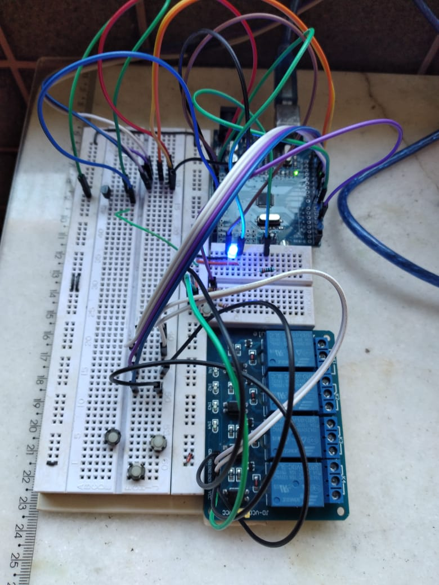
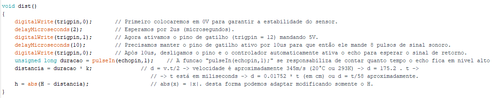
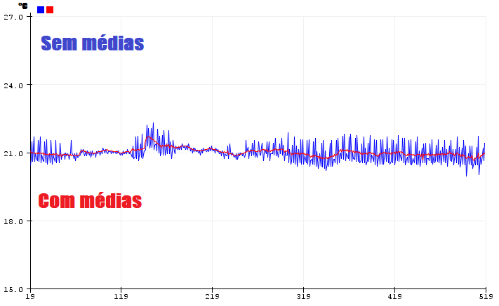
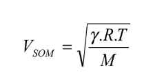
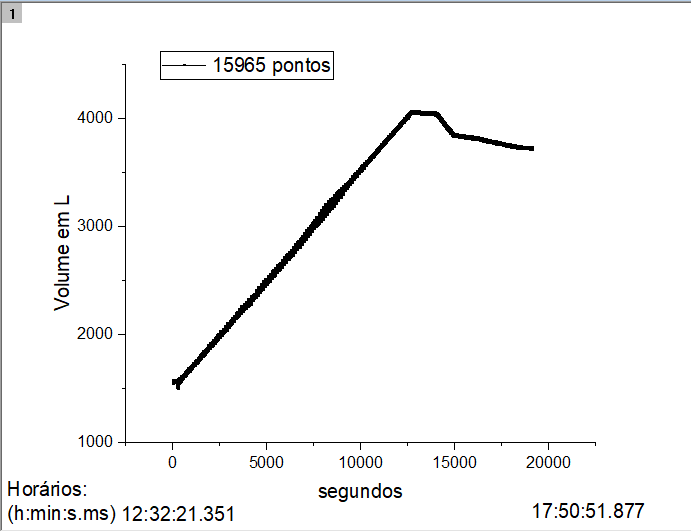
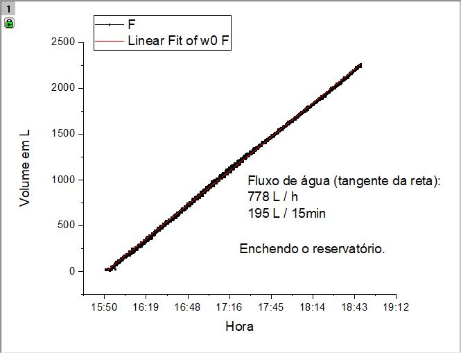

# Water ++
W ++ is a software and hardware system that allows you to manage smartly a tank of liquids. In this context, my final project contains three functionalities:
- Calculates, anytime, as precise as possible, using statistics, how much water contains in a tank.

- Calculates and manages how much water do you spend per day using graphics and controls the flux of water.

- Identifies leakage and water loss caused in the tank.

# Why this project is important?

Mostly because we need solutions for sustainable developments projects. In this case, about water. Due to COVID-19, we are in a critical moment and we must improve how to use water daily, since social distancing is making us stay longer at home and, hence, spending more water than usual.  
Moreover, implementation of integrated water management resources is the objective 6 of 2030 United Nations agenda (The sustainable development agenda):
>Sustainable development goal 6.

In this goal, subitem 4:
>6.4 By 2030, substantially increase water-use efficiency across all sectors and ensure sustainable withdrawals and supply of freshwater to address water scarcity and substantially reduce the number of people suffering from water scarcity.

Therefore, it is essential to exist technologies tools to improve way how we use water daily.

### Part 1: Hardware.
- First, we need make a littlle circuit, as described below:  

- Second, we need to write a code to get and set information anytime, because we have two sensors, which must be queried, and one relay module, that must be set.

- I used Arduino's IDE to code and control hardware below:

- [x] Arduino uno.
- [x] Relay module.
- [x] 1 led blue.
- [x] 1 button.
- [x] 2 resistor (220 ohms).
- [x] LM35 (Temperature).
- [x] Jumpers.
- [x] Sensor ultrassonic HC-SR04.
- [x] Protoboard.

### Part 2: Software.
- First, I wrote a code that reads the LM35 and calculates local temperature. In this context, we need to use "analogRead(A0);"
wherein "A0" is a pin that I use. Arduino has a registrador of 8 bits, which contains 1024 values of voltage.

- Second, I wrote a code can read the HC-SR04 and calculate distance until "object", in this case, water column
#### Step 1:
>Activate the trigger pin to emit a pulse of sound.
#### Step 2:
>Activate echo pin for get the return of the sound emitioned by trigger.
#### Step 3:
>The distance until object can be calculated by this simple equation that depends on the sound velocity: distance = sound_velocity * time / 2 .

### Part 3: Experimental error.
- In this project, I believe that is difficult to meansure physical quantities like a temperature, distance and sound velocity in the air. Thereupon, I use my newfound (Thanks CS50) to improve the precision in each measure. Later I'll show you some tricks that improve any measurements.

#### Avarege:
- We will analise the temperature, but this can be make for any sample data. First, I use a pointer:
 >BYTE *mid = malloc(nt * sizeof(float));

Now, I'll sum every floats in chunks to get an average. The result, wherein I compare two graphics:without and with avarege.

#### Sound velocity:
- Now, I can calculate sound velocity in the air using the expression below:

Remember, the air is composed by 80% of N2 and 20% of O2. Also, M = 28.8 g/mol and gama = 7/5. Thus, we have: v = sqrt(T) * 20.086 (T in Kelvin).

#### Part 4: Graphics and data.
- I used the Arduino to make a file tab separate values in the computer and, finally, I plotted this data. See the results!

